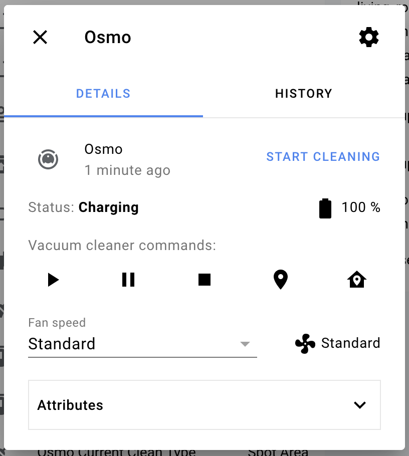
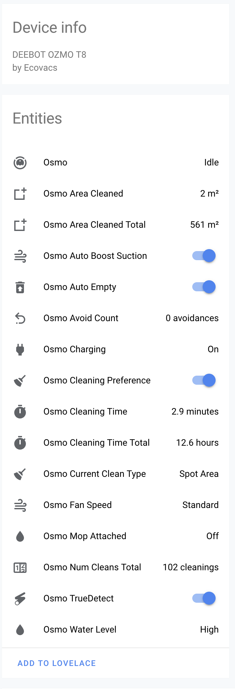
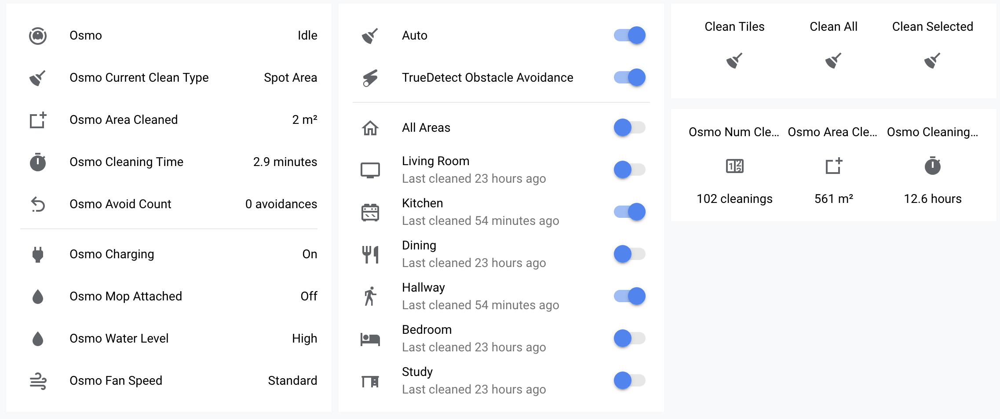

# Ecovacs Deebot OZMO T8 For Home Assistant

Custom component/integration for Home Assistant to support Ecovacs DEEBOT OZMO T8 line of robots

This integration utilizes the [deebot-t8](https://github.com/nickw444/deebot-t8) library for communication

## Supported Robots

 * Ecovacs Deebot Ozmo T8 (Model: OT8G)

Other Deebot Ozmo T8 variant robots will likely also work, but have not been tested. Please open an issue if you have success with other models 😊

## Install

Download this repo and copy the `custom_components/deebot_t8` into your `custom_components` directory

## Integration Screenshots

|  |   |
| -- | -- |
| Exposed Vacuum Entity | All Exposed Entities |

## Endless Possibilities

This a screenshot from my Robot Vacuum page on my Lovelace dashboard:

Using this integration, I have added support for a handful of useful iOS notifications:

|  |   |
| -- | -- |
| Presence based cleaning reminder/prompt | Mop triggered cleaning prompt |

Automations can be found in my [home repo](https://github.com/nickw444/home) in the [automations directory](https://github.com/nickw444/home/tree/master/home-assistant/martin-pl/automations/living_room/robot_vacuum).
